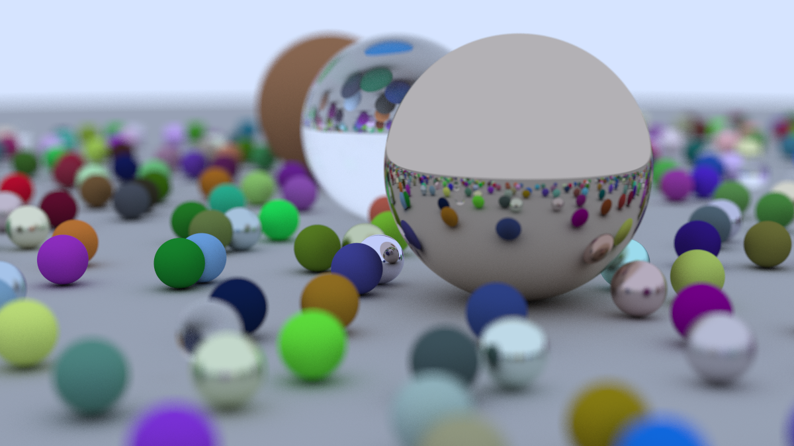
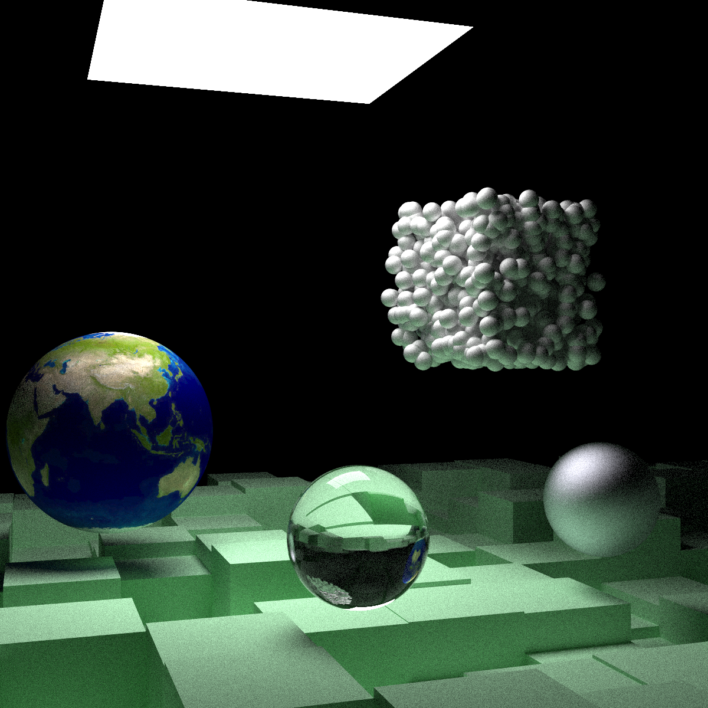
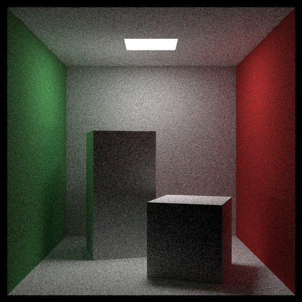

# Rust based Raytracer

The same raytracer as in [cpp/README.md](../cpp/README.md), but implemented in `rust`.
The plan is to take this implementation further as I find developing the raytracer in rust to be a much more enjoyable time (compared to cpp).

This was a good reason and project to learn rust and implement something somewhat complicated too.
Also, the fact that the project requires no API, means it is lightweight and easy build. (It also helps that it is quite easy to cross-compile pure rust in multiple platforms)

Here are some examples:

Weekend Final Render

Week Final Render (Without perlin noise and gas demos)

Cornell Box

More generated images [here](./images.md)

## Quickstart

Requires:

- `rustup`/`cargo`
- clang (Or any linker)

To build and run:

- `cargo run -r`
  - Runs the `main.rs` file and has the ppm file contents write to `stdout`
  - A better command to run would be `cargo run -r > test.ppm`
- `cargo build -r` and run the binary at `target/release/rust-simple-raytracer(.exe)`

## Development

Mainly developed on VSCode on Linux.
Tested to compile and run just fine on linux or windows.

### Development Notes

- The only libraries used are to make interfacing with the project easier
  - Clap - For handling CLI
  - Rayon - For easier and better multi-threading performance (Needed for more complicated renders)
  - indicatif - For progress bar in the terminal
  - image - For handling output to a `png` image
    - Was simply using the `ppm3` format to stdout before this

- `src` - Source Code
  - `bin` - Specific binary files that are compiled with the ray tracing library
    - `others`  - Contains other examples I did before implementing the CLI helper

## Acknowledgements, References and Related Projects

I used quite a bit of references for this project, particularly to see how to implement the same things the `"rust"` way to help me in understand and solidify the harder concepts of rust.
In no particular order:

- [dps rust raytracer](https://github.com/dps/rust-raytracer)
  - First result you see on google
  - [His accompanying blog post](https://blog.singleton.io/posts/2022-01-02-raytracing-with-rust/)
- [Chris Biscardi's Rust Adventure raytracer project](https://github.com/rust-adventure/raytracing-in-one-weekend/tree/f69c57162de6b3e7538bc26f5611f4e1142414b5)
  - [The accompanying youtube video](https://www.youtube.com/watch?v=6D8WVYm1YwY)
    - Very usefully as he talks about implementing the raytracer along with the book, interjecting insights and reasoning for his code in rust (Compared to cpp)

## Things I thought were interesting

### Rust borrow checker/General code

For me, compared to `c++` it is much easier to see when, where and how a object will/will not be modified.
I attribute this to the fact that in `rust` the borrow checker makes it clear when object are immutable and/or passed.

A clear example for me was any code which required me to pass in an empty `HitRecord` object in `c++`.
This is beacuse this object is modified at multiple places to store the point of intersection and cordinates of the hit on the surface of an object.
Another behaviour is that the functions that want to return the `HitRecord` might also fail to, because the light ray would hit nothing.

In rust, we have the enum `Option` to encapsulate returning a nullable value as well as ensure when and where the `HitRecord` is passed as a mutable reference or created again.

### Rust robust built in tools

The combination of `rustfmt`, `clippy`, `rust-analyzer` and the compiler makes the development experience much better in `rust`.
I also cannot over state how much easier it is to setup a development environment in rust as compared to `cpp` (or most other languages for that matter - I have only really done work with `python`, `c++` and `JS/TS`). Here are a few points with some direct cross-comparisons with other langauges.

#### Integration of langauge server with IDE

(For context, I mainly do all my development in `VSCode` and have a very minial `vim/neovim` setup I use for editing code/text when I need to)

The integration of the langauge server (rust-analyzer) just works with `VSCode`.
Any option you need as well as the detection of config files(`Cargo.toml`) works.
I don't need to add in some hack for searching for config paths, I don't need to hope that the extension or langauge server picks up my local version of rust/local libraries or that it has gotten the correct type information.
The hints (and typing) it provides in the editor helps in development and in understanding what is happening (granted this is just baked into rust with it being strongly typed).

For comparison in python:
You would have to install `pyliny(or any other linter - i.e. pyright), black, isort and mypy` to get to a baseline of what rust has OOTB.
Granted they technically are external libraries, but installing them and running them on every rust project is seamless.
On python, getting these libraries installed system wide is not really an option for development on multiple applications with different python versions.
As for getting them to work on a per project basis, its always a trail and error process, hoping you installed a captiable version with your main python version and libraries you used.
You then pray that no breaking changes are shipped either to the extension or library that breaks functionality of the linter, formatter, or typing, or all of them at once, in your IDE (or worse introduce a single bug error/warning that getting rid of is somewhat troublesome with a hack).

For `c++` besides ensuring you have the correct `stdlibs` and `libdev` packages installed, you would also probably want to use `CMake`.
That is because linking and compiling all the different header files and code files is not something you want to write by hand when it gets longer than a single file.
But this takes time away from coding and development of the application to deal with config issues, especially when compiling and running this on different hardware and software. (I am specifically referring to trying to get the same code to compile on different linux systems - arch, ubuntu, as well as different windows systems - mainly my main PC as well as other workstations that I happen to use and would like to continue development on, could be friends or work/school/cloud related systems)
