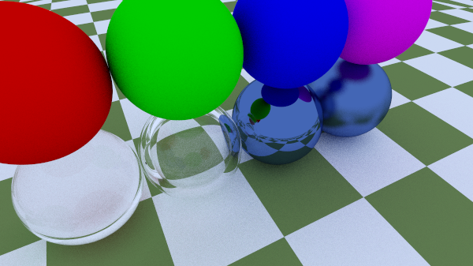
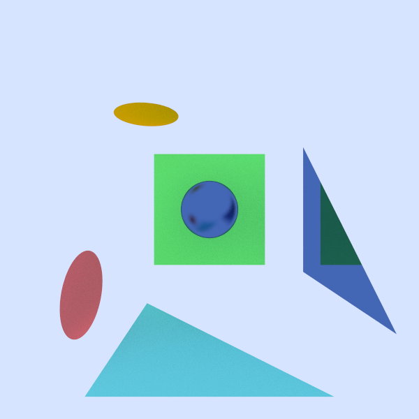
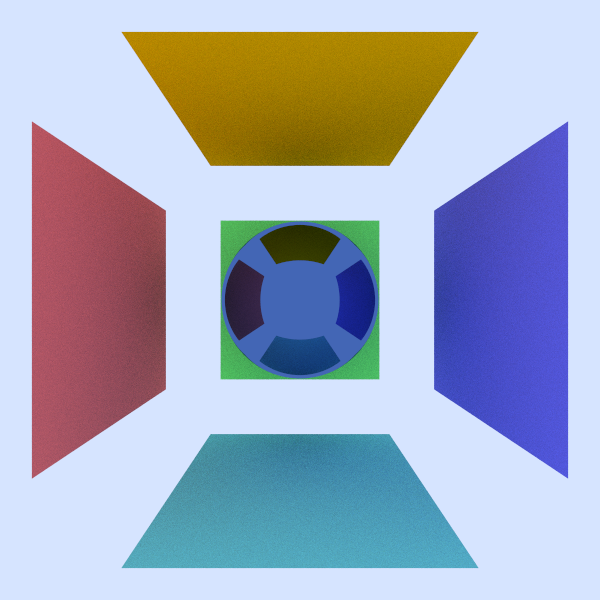
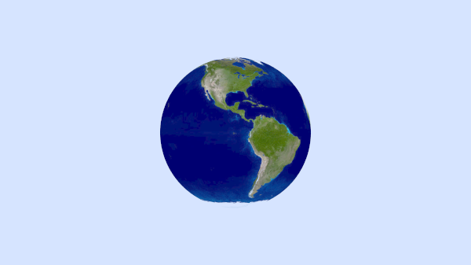
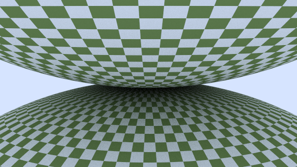
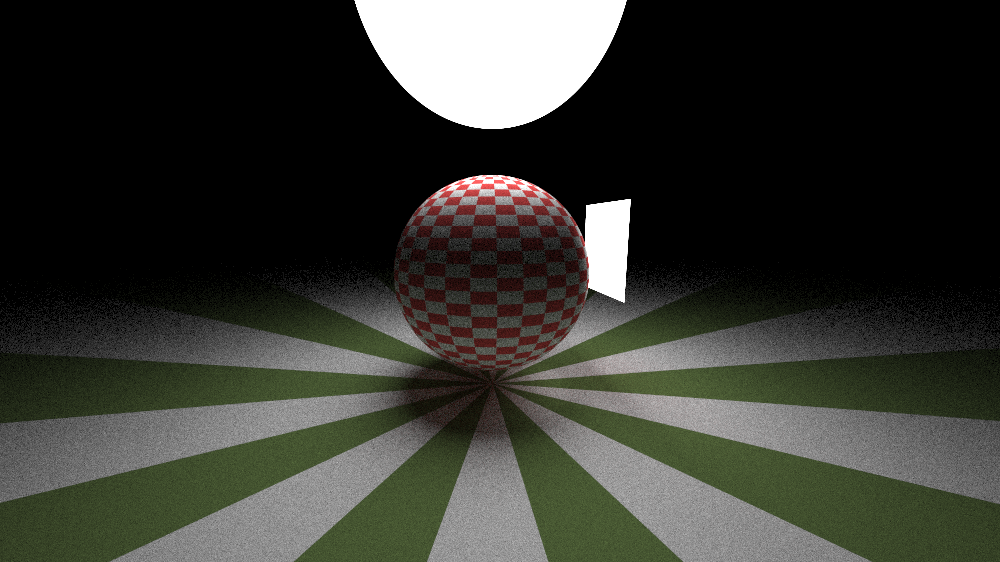

# More Images

  
Simple Balls - Showing off all the different materials implemented in the weekend series  

  
Planar Demo - Showing off the different planar objects implemented in the ray tracer  

  
Simple Quad Demo - Before making the cornell box  

  
Earth Demo - Showing off texture maping  

  
Showing off proper checkered patterns on 2 spheres  

  
A simple light demo showing diffuse lights  

